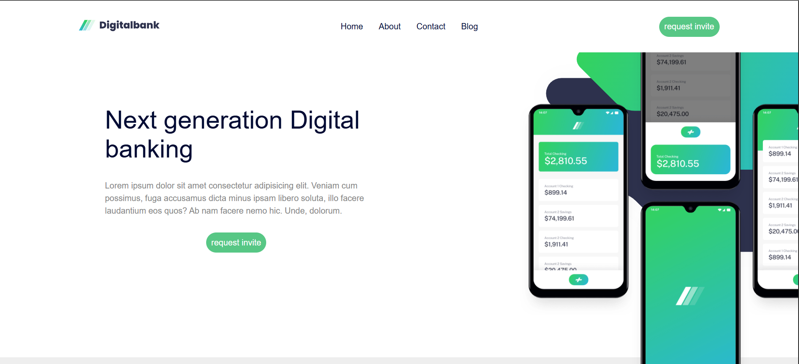

# Digital Bank Landing Page

A modern and responsive banking landing page built with HTML, CSS, and JavaScript.

## 📋 Overview

This project is a responsive landing page for a digital banking service. It features a clean and modern design, a mobile-friendly navigation menu, and multiple content sections showcasing banking features and latest articles.

The project was developed to practice:

- Semantic HTML
- CSS Flexbox
- Responsive Web Design
- Mobile Navigation Menu
- CSS Variables
- Basic JavaScript DOM Manipulation

---

## 🚀 Features

- Responsive design for desktop and mobile devices
- Fixed navigation header
- Mobile hamburger menu
- Hero section with promotional content
- Banking features section
- Latest articles section
- Modern footer layout
- Clean and reusable CSS structure

---

## 🛠️ Technologies Used

- HTML5
- CSS3
- JavaScript (Vanilla JS)

---

## 📱 Responsive Design

The layout automatically adapts to different screen sizes:

- Desktop
- Tablet
- Mobile

A hamburger menu is displayed on smaller screens for improved navigation.

---

## 📂 Project Structure

```text
project/
│
├── index.html
├── style.css
├── index.js
│
├── images/
│   ├── logo-dark.svg
│   ├── logo-light.svg
│   ├── image-mockups.png
│   └── ...
│
└── README.md
```

---

## 📸 Screenshot

Add a screenshot of the project here:

```md

```

Place your screenshot inside the images folder and update the file name if needed.

---

## ⚙️ How to Run

1. Clone the repository

```bash
git clone https://github.com/your-username/your-repository.git
```

2. Open the project folder

3. Run `index.html` in your browser

---

## 🎯 Learning Goals

This project helped improve my understanding of:

- Responsive layouts
- Flexbox positioning
- Mobile-first thinking
- DOM manipulation with JavaScript
- UI implementation from design references

---

## 👨‍💻 Author

Developed by Mohammadreza

GitHub: https://github.com/your-github-username
